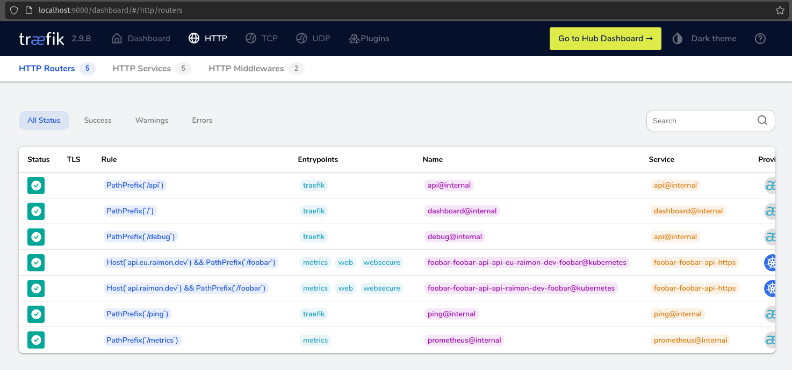

# Challenge

The purpose of this repository is to answer to a challenge that was given me: Deploy a full Kubernetes platform in two different regions to host the [foobar-api](https://github.com/containous/foobar-api).

* [Introduction](#introduction)
* [Step 1 - Kubernetes Clusters](#step-1---kubernetes-clusters)
* [Step 2 - Install Flux](#step-2---install-flux)
* [Step 3 - Foobar API Deployment](#step-3---foobar-api-deployment)
  * [The Docker image](#the-docker-image)
  * [The Registry secret](#the-registry-secret)
  * [The TLS certificate](#the-tls-certificate)
* [Step 4 - Ingress Controller](#step-4---ingress-controller)
* [Step 5 - DNS & TLS certificate](#step-5---dns--tls-certificates)

## Introduction

The first step is to make some choices regarding the infrastructure. Given the challenge description I see two requirements:

1. The Foobar API must run in Kubernetes
2. It must run in two different regions (with cross-region load balancing in mind)

The first decision made was to go with `GKE`, for a couple of reasons:

1. I don't know anything about `GKE`, but I'm very curious because most comparison I saw put it in first place
2. It seems most of the default addons are builtin, I don't have to bother with `kube-proxy` or the `CNI` for this challenge
3. It's an opportunity to learn more about `GCP`

I didn't want to spend too much time on deploying those resources (`GCP` or `Kubernetes`), so I decided to use tools that I'm familiar with:

1. `terraform` to manage the `GCP` resources
2. `flux` to manage the `Kubernetes` resources

Along the challenge implementation, I will try to note every decision where I believe it could be done better.
Given the time frame, my schedule and my limited bank account, I will probably have to cut corners (especially in terms of security)

## Step 1 - Kubernetes Clusters

The first step is to initialize the Kubernetes clusters with `GCP` and `terraform`.

Let's begin by registering a [GCP account](https://console.cloud.google.com/home/dashboard), and create a project (mine is called `foobar`). Then follow the [setup documentation](./setud.md) to install the and configure the CLI tools.

Before we start creating GKE clusters, we'll first create a GCS bucket to store our Terraform state:

```sh
terraform -chdir=./terraform/root/storage init
terraform -chdir=./terraform/root/storage apply
```

The bucket has versioning enabled in case you want to revert to a previous state.
And the Terraform GCS backend supports locking by default !
That should prevent concurrent execution of Terraform modules

Once this is done we can start the modules in charge of the GKE clusters:

1. [eu-west9](../terraform/production/eu-west9/main.tf)
2. [us-east1](../terraform/production/us-east1/main.tf)

> The code used here is heavily inspired by the example of the [Terraform GKE module](https://github.com/terraform-google-modules/terraform-google-kubernetes-engine/tree/master/examples)

Here's a quick overview of the Terraform code used to spin up the GKE clusters:

```terraform
# Uses the google network module to create a VPC for the GKE cluster
# - It has one primary subnet for the nodes and the control planes (10.0.0.0/16)
# - A secondary subnet for PODs (192.168.0.0/18)
# - A secondary subnet for Services (192.168.64.0/18)

module "network" {
  source  = "terraform-google-modules/network/google"
  version = ">= 4.0.1"

  network_name = "${local.cluster.name}-network"
  subnets = [
    {
      subnet_name   = "${local.cluster.name}-subnet"
      subnet_ip     = "10.0.0.0/20"
      subnet_region = local.region
    },
  ]

  secondary_ranges = {
    "${local.cluster.name}-subnet" = [
      {
        range_name    = "${local.cluster.name}-pods"
        ip_cidr_range = "192.168.0.0/18"
      },
      {
        range_name    = "${local.cluster.name}-services"
        ip_cidr_range = "192.168.64.0/18"
      },
    ]
  }
}

# Now we create the GKE cluster, giving it the network subnets created above
# It'll will deploy the latest version (1.24) with e2-small (cheap, general purpose instances) nodes
module "gke" {
  source      = "terraform-google-modules/kubernetes-engine/google"
  name        = local.cluster.name
  zones       = local.zones
  region      = local.region
  regional    = true
  description = "Foobar GKE in ${local.region}"

  # Networking
  network           = module.network.network_name
  subnetwork        = module.network.subnets_names[0]
  ip_range_pods     = module.network.subnets_secondary_ranges[0].*.range_name[0]
  ip_range_services = module.network.subnets_secondary_ranges[0].*.range_name[1]

  # Version
  release_channel    = "STABLE"
  kubernetes_version = "1.24"

  # Security
  remove_default_node_pool = true
  service_account          = "create"

  # Node pools
  node_pools = [
    {
      name         = "default-small"
      machine_type = "e2-small"
      min_count    = 1
      max_count    = 2
      auto_upgrade = true
      auto_repair  = true
      disk_size_gb = 20
      disk_type    = "pd-standard"
    }
  ]
}
```

We can test on Europe with the following commands:

```sh
# Run terraform to create the VPC + GKE cluster (~5-10 minutes)
$ terraform -chdir=terraform/production/eu-west9/ init
$ terraform -chdir=terraform/production/eu-west9/ apply

# Get access to the GKE cluster
$ export KUBECONFIG=~/.kube/foobar
$ gcloud container clusters get-credentials foobar-europe-west9 --region=europe-west9

# Check it's working fine
$ kubectl get nodes
$ kubectl get pods -A

# Once it's validated, you can delete the GKE cluster to avoid being billed too much
$ terraform -chdir=terraform/production/eu-west9/ destroy -target=module.gke
```

Done ! We now have two GKE clusters in two different regions, next step will be to deploy things on those clusters using Flux

**Improvements**

- [ ] Manage the GCP project ID a bit differently (en environment variable on a laptop is error prone)
- [ ] GitOps the Terraform modules, either with TF Cloud or Flux [terraform-controller](https://github.com/weaveworks/tf-controller)
- [ ] Use a [GCP Service Account](https://developer.hashicorp.com/terraform/language/settings/backends/gcs#running-terraform-on-google-cloud) for Terraform
- [ ] Check some [GCP Best Practices](https://www.whizlabs.com/blog/gcp-best-practices/)

## Step 2 - Install Flux

So now we're on our way to install Flux on our GKE clusters.
Since I'm probably going to destroy/re-create those GKE clusters quite often, I would prefer if Flux comes pre-installed and configured as soon as Terraform is finished.

To do that we're going to create a Terraform module, that we'll instantiate in the same module where the GKE cluster is created.
Ideally the defaults are sane, and I just have to give the module some inputs regarding which Git repository and which path I want to reconcile, something like the following:

```terraform
module "flux" {
  source = "../../modules/flux"

  repositories = {
    foobar-infra = {
      git = {
        url = "ssh://git@github.com/barolab/foobar-infra"
      }

      kustomizations = {
        flux-system = { path = "./kubernetes/production/eu-west9/flux-system"}
      }
    }
  }
}
```

We're going to synchronize only one path for now, it will be `./kubernetes/production/<region>/flux-system`.
This directory will contain more Flux `Kustomization` pointing to other directories in this repo.
This will allow me to test some features like health checks and dependencies!

There's a couple of things that needs to happen for Flux to be working properly:
1. The namespace needs to be created, since the GKE cluster will be empty
2. Flux will need and SSH Key Pair configured as a Deploy Key on the Github Repository
3. This SSH Key Pair needs to be available in a Kubernetes Secret
4. Flux controllers will have to be deployed (only `source`, `kustomize` and `helm` for now)
5. Flux needs the `GitRepository` and `Kustomization` resources to start reconciling resources

All those steps are implemented with Terraform in the [flux module](../terraform/modules/flux/main.tf) !
And the only thing you need to give to Terraform is an environment variable `GITHUB_TOKEN`.
For now I'm using a Github PAT with Read/Write permissions on this repository settings, allowing
the module to add Deploy Keys.

And some evidences that everything work as expected (it uses a temporary branch):


```sh
$ kubectl -n flux-system get ks
NAME                       AGE   READY   STATUS
foobar-infra-flux-system   10m   True    Applied revision: feat-flux-installation@sha1:fe15097a8968ae44b5c7c16bf5eb69c56c4ba10f
podinfo                    66s   True    Applied revision: feat-flux-installation@sha1:fe15097a8968ae44b5c7c16bf5eb69c56c4ba10f

$ kubectl -n podinfo get hr
NAME      AGE     READY   STATUS
podinfo   3m12s   True    Release reconciliation succeeded

$ kubectl -n podinfo get pods
NAME      AGE   READY   STATUS
podinfo   90s   True    Release reconciliation succeeded
```

That's it for the Flux installation step, next we will:
- Add the Foobar API code
- Create a CI job to release the Foobar API Docker Image somewhere
- Deploy it with Flux !

**Improvements**

- [ ] Use a Github Service Account to create the SSH deploy key
- [ ] Find a better way than using an Environment Variable to pass the Github Token to Terraform

## Step 3 - Foobar API deployment

For this step the goal is to have the `foobar-api` up and running on our GKE cluster.
We'll try to access it with a `kubectl port-forward` to make sure it's working properly.

There's a couple of requirements to do so:
1. The `foobar-api` needs to be available as a Docker Image on a Registry
2. The GKE clusters must had access to that Registry
3. The `foobar-api` needs a TLS certificate to boot
4. We need the Kubernetes manifests for the `foobar-api` on Flux

We won't necessarily try to have a valid TLS certificate.

### The Docker image

For the first requirements, it's rather simple, we add the Go source code under [./app](../app/main.go),
add a [Dockerfile](../app/Dockerfile) and setup a [Github Workflow](../.github/workflows/release.yml) to
automatically release the Docker image on a push to a branch.

### The Registry Secret

The Docker Image will be released on GHCR, and since we're using a private repository we need to have
a Kubernetes Docker config secret with a Token that `kubelet` can use to pull the Docker image.

For simplicity I'll use a PAT from my Github Account instead of using a Service Account, the only permissions
that this token requires is `read:packages`.

We'll pass that to Terraform using the ENV variable, and since we're adding more and more variables to those
Terraform modules, we'll wrap them all into a `.env` file at the root of this repository.

### The TLS certificate

Looking at the code for the `foobar-api` application, you'll see that the application needs a
TLS certificate in order to boot.

Running it locally will prove it quite quickly:

```sh
$ cd ./app
$ go mod download
$ go run main.go
Starting up on port 80
2023/03/24 12:17:45 You need to provide a certificate
exit status 1
```

So let's create a self-signed certificate manually, and try to boot the application:

```sh
$ mkdir cert
$ openssl req -nodes -new -x509 \
  -keyout cert/key.pem -out cert/cert.pem \
  -subj "/C=FR/ST=France/L=Nantes/O=Dis/CN=foobar.raimon.dev"

$ docker run --rm \
  -p 8080:80 \
  -v "$(pwd)/cert:/cert" \
	ghcr.io/barolab/foobar-api:latest
Starting up on port 80
```

Looks like the application as started properly, let's make sure:

```sh
$ curl -k https://localhost:8080
Hostname: 0a90aee2c3eb
IP: 127.0.0.1
IP: 172.17.0.2
RemoteAddr: 172.17.0.1:43804
GET / HTTP/1.1
Host: localhost:8080
User-Agent: curl/7.81.0
Accept: */*
```

Apart from the `-k` option, it seems it's working fine!

### Kubernetes Deployment

And now for the Kubernetes part, we'll need:
- a [PersistentVolumeClaim](../kubernetes/base/foobar/foobar-api/pvc.yml)
- a [Deployment](../kubernetes/base/foobar/foobar-api/deployment.yml)
- a [Service](../kubernetes/base/foobar/foobar-api/service.yml)

Since GKE only supports `ReadWriteOnce` PV out of the box, we'll stick with this.

his add two constraints to our `Deployment`:
1. We can have only one replica at a time
2. We have to use the `Recreate` strategy

Another solution would be to use a `StatefulSet`, but that would mean each replica will have
a different certificate, which is not intended for now.

Then using Flux & Kustomize, we're only a couple of files away from deploying this to GKE:
- [eu-west9](../kubernetes/production/eu-west9/foobar/kustomization.yaml)
- [us-east1](../kubernetes/production/us-east1/foobar/kustomization.yaml)

**Improvements**

- [x] A better release process for the Docker Image, based on Github releases rather than push to any branch ([PR#7](https://github.com/barolab/foobar-infra/pull/7))
- [ ] Something to automate the Kubernetes Docker config deployment (SealedSecrets / External Secrets, Kyverno, etc...)
- [ ] Docker image should *NOT* run as root (and Kubernetes Security Context should be set accordingly)
- [ ] Use a `StatefulSet` and change the InitContainer to get the certificate from a backend service (like Vault)


## Step 4 - Ingress Controller

Once our `foobar-api` is up and running, we can start thinking about exposing it to the outside world.
For this we're going to use Traefik Proxy with GKE Load Balancers.

Just like with the `foobar-api` we're going to use a Kustomize base referenced in each regions:
- [Traefik Base](/kubernetes/base/kube-network/kustomization.yaml)
- [Europe Kustomization](/kubernetes/production/eu-west9/flux-system/kube-network.yml)
- [Europe Overlay](/kubernetes/production/eu-west9/kube-network/kustomization.yaml)

While doping this we're going to experiment a bit with two features of Flux which I think are very useful here.
To avoid spending too much money on GCP resources, I usually destroy everything once I validated my changes.
Which means the dependencies have to be set properly, and services needs to boot once their dependencies are ready.

And that's exactly what Flux does here:

```sh
$ kubectl get ks -A
flux-system   crds                       36s   True      Applied revision: feat-deploy-traefik@sha1:bd3887c743ddeb6289016dd0a668486dee41cf39
flux-system   foobar                     36s   False     dependency 'flux-system/kube-network' is not ready
flux-system   foobar-infra-flux-system   42s   Unknown   Reconciliation in progress
flux-system   kube-network               36s   Unknown   Reconciliation in progress
flux-system   podinfo                    36s   True      Applied revision: feat-deploy-traefik@sha1:bd3887c743ddeb6289016dd0a668486dee41cf39
```

The CRDs have been properly reconciled, so `kube-network` (where Traefik is deployed) can be reconciled.
But `foobar` needs `kube-network` in order to work (for the `Ingress` resource), and so Flux waits for the
dependency to be ready.


And all Kustomizations are Ready, we have our Traefik PODs, and a Load Balancer with a public IP:
```sh
$ kubectl -n kube-network get pods
NAME                             READY   STATUS    RESTARTS   AGE
traefik-proxy-6df7c7b94d-44g7k   1/1     Running   0          19s
traefik-proxy-6df7c7b94d-bfwwl   1/1     Running   0          19s

$ kubectl -n kube-network get svc
NAME                TYPE           CLUSTER-IP        EXTERNAL-IP    PORT(S)                      AGE
traefik-proxy-api   ClusterIP      192.168.123.242   <none>         9100/TCP,9000/TCP            67s
traefik-proxy-lb    LoadBalancer   192.168.85.50     34.155.XXX.XXX 80:32662/TCP,443:31270/TCP   67s
```

Using a port-forward on port 9000 on the service `traefik-proxy-api` we can check the Traefik Proxy
dashboard and make sure our `foobar-api` route is present:



All good, now let's try to curl that Ingress using the Load Balancer IP:

```sh
$ curl -v http://api.raimon.dev/foobar --resolve "api.raimon.dev:80:34.155.XXX.XXX"
* Added api.raimon.dev:80:34.155.XXX.XXX to DNS cache
* Hostname api.raimon.dev was found in DNS cache
*   Trying 34.155.XXX.XXX:80...
* Connected to api.raimon.dev (34.155.XXX.XXX) port 80 (#0)
> GET /foobar HTTP/1.1
> Host: api.raimon.dev
> User-Agent: curl/7.81.0
> Accept: */*
>
* Mark bundle as not supporting multiuse
< HTTP/1.1 500 Internal Server Error
< Date: Sun, 26 Mar 2023 09:20:52 GMT
< Content-Length: 21
< Content-Type: text/plain; charset=utf-8
<
* Connection #0 to host api.raimon.dev left intact
Internal Server Error%
```

Bummer, there's an error somewhere in the stack. The first thing we want to validate is whether or not
the HTTP request reached our `foobar-api` service:

```
$ kubectl -n foobar logs -f deploy/foobar-api
...
2023/03/26 09:20:52 http: TLS handshake error from 192.168.1.13:42042: remote error: tls: bad certificate
```

Seems like the Time matches, the request reached our `foobar-api` but failed with a TLS error.
The problem is most likely that we're trying to validate that certificate even if it's a self-signed one.

Let's tell [Traefik to skip the TLS verification on backend services](https://github.com/barolab/foobar-infra/pull/11/files#diff-73c5d75b064816d4bace7d59f84beb987877037693938175bdad68f68df6d636R71) and try again:

```sh
$ curl -v http://api.raimon.dev/foobar --resolve "api.raimon.dev:80:34.155.XXX.XXX"
* Added api.raimon.dev:80:34.155.XXX.XXX to DNS cache
* Hostname api.raimon.dev was found in DNS cache
*   Trying 34.155.XXX.XXX:80...
* Connected to api.raimon.dev (34.155.XXX.XXX) port 80 (#0)
> GET /foobar HTTP/1.1
> Host: api.raimon.dev
> User-Agent: curl/7.81.0
> Accept: */*
>
* Mark bundle as not supporting multiuse
< HTTP/1.1 200 OK
< Content-Length: 393
< Content-Type: text/plain; charset=utf-8
< Date: Sun, 26 Mar 2023 10:05:35 GMT
<
Hostname: foobar-api-57d8d7f68c-x2njn
IP: 127.0.0.1
IP: 192.168.0.8
RemoteAddr: 192.168.1.10:51206
GET /foobar HTTP/1.1
Host: api.raimon.dev
User-Agent: curl/7.81.0
Accept: */*
Accept-Encoding: gzip
X-Forwarded-For: 192.168.1.1
X-Forwarded-Host: api.raimon.dev
X-Forwarded-Port: 80
X-Forwarded-Proto: http
X-Forwarded-Server: traefik-proxy-6db6bd9cbb-d5tws
X-Real-Ip: 192.168.1.1

* Connection #0 to host api.raimon.dev left intact
```

Here we are, our `foobar-api` gave us a response !
Skipping certificate validation is not ideal though, we'll have to try and use certificates that are valid (at least for the Traefik PODs, not necessarily for public clients)

**Improvements**

- [ ] Use a private authority to sign certificates that will be valid for both `foobar-api` and `traefik-proxy` (and remove [this flag](https://github.com/barolab/foobar-infra/pull/11/files#diff-73c5d75b064816d4bace7d59f84beb987877037693938175bdad68f68df6d636R71))


## Step 5 - DNS & TLS Certificates

Time to make the `foobar-api` publicly available !
For this we need to have a DNS record pointing to our Load Balancer, and a valid TLS certificate to make sure the public connection between Traefik and our clients are secured.

We'll start by creating a Google Cloud DNS Zone with Terraform under [/terraform/root/dns](/terraform/root/dns/main.tf).

> I'm using a personal registered DNS name with no records on it yet.
> I just changed the NS record to the GCP ones to make sure I properly resolve the DNS records registered on GCP.

Once we have a DNS zone, we're going to create a DNS A record using terraform.
It will be a regional records, with the IPs of both EU & US load balancers.

For now there is no health check, we just get the IPs from Kubernetes service status under
[/terraform/production/dns](/terraform/production/dns/main.tf). Running a plan seems to give us what we want:

```sh
  # google_dns_record_set.api will be created
  + resource "google_dns_record_set" "api" {
      + id           = (known after apply)
      + managed_zone = "public-raimon-dev"
      + name         = "api.raimon.dev."
      + project      = (known after apply)
      + ttl          = 30
      + type         = "A"

      + routing_policy {
          + geo {
              + location = "europe-west9"
              + rrdatas  = [
                  + "34.163.106.236",
                ]
            }
          + geo {
              + location = "us-east1"
              + rrdatas  = [
                  + "34.23.1.19",
                ]
            }
        }
    }
```

Let's connect to the GKE clusters and look at the IP of the Load Balancers to make sure everything is alright:

```sh
$ export KUBECONFIG=~/.kube/foobar-eu
$ kubectl -n kube-network get svc
NAME                TYPE           CLUSTER-IP       EXTERNAL-IP      PORT(S)                      AGE
traefik-proxy-api   ClusterIP      192.168.93.62    <none>           9100/TCP,9000/TCP            13m
traefik-proxy-lb    LoadBalancer   192.168.83.128   34.163.106.236   80:30558/TCP,443:30696/TCP   13m

$ export KUBECONFIG=~/.kube/foobar-us
$ kubectl -n kube-network get svc
NAME                TYPE           CLUSTER-IP       EXTERNAL-IP   PORT(S)                      AGE
traefik-proxy-api   ClusterIP      192.168.94.226   <none>        9100/TCP,9000/TCP            13m
traefik-proxy-lb    LoadBalancer   192.168.99.86    34.23.1.19    80:31523/TCP,443:31843/TCP   13m

# Let's use our favorite linux tool to validate all of this
# I'm in France so expect the EU IP as the DNS query response
$ dig api.raimon.dev
....
;; ANSWER SECTION:
api.raimon.dev.         30      IN      A       34.163.106.236

# Now we send an HTTP request (curl uses the proper IP)
$ curl -v http://api.raimon.dev/foobar
*   Trying 34.163.106.236:80...
* Connected to api.raimon.dev (34.163.106.236) port 80 (#0)
...
Hostname: foobar-api-57d8d7f68c-pzn5p
...
```

Good ! Now we need to generate a TLS certificate. The easiest and cheapest solution is to use Let's Encrypt
with CertManager.

And to make things a bit more fun, we're going to use DNS Challenge to validate the certificate. And in order
for CertManager to access GCP DNS zones, we're going to use a GKE Workload Identity.

For AWS experts, it's exactly like an IRSA, meaning your K8S Service Account can access a GCP Service Account by using the K8S short lived token. Thanks to the Terraform GKE module, this is rather easy to make:

```terraform
module "cert_manager" {
  source     = "terraform-google-modules/kubernetes-engine/google//modules/workload-identity"
  name       = "cert-manager"
  namespace  = "kube-security"
  roles      = ["roles/dns.admin"]
}
```

And once applied, we can see the Service Account exists in our GKE clusters, and check that it has the annotation referring to our GCP Service Accounts:

```sh
$ kubectl -n kube-security get sa cert-manager -o yaml
apiVersion: v1
kind: ServiceAccount
metadata:
  name: cert-manager
  namespace: kube-security
  annotations:
    iam.gke.io/gcp-service-account: europe-west9-cert-manager@foobar-XXXXXXXXXX.iam.gserviceaccount.com
```

Once this is done, we deploy Cert Manager, along with a Let's Encrypt [Issuer](/kubernetes/production/eu-west9/kube-security/tls/letsencrypt-issuer.yaml).
We also add the Cert Manager annotation to our Foobar [API Ingress](/kubernetes/base/foobar/foobar-api/ingress.yaml) and check that the certificate gets created:

```sh
$ kubectl -n foobar describe ingress foobar-api
...
Events:
  Type    Reason             Age   From                       Message
  ----    ------             ----  ----                       -------
  Normal  CreateCertificate  19s   cert-manager-ingress-shim  Successfully created Certificate "foobar-api-tls"
```

We're one step away from having a secured, public endpoint for our API. We just configure Traefik to set TLS on 443 and force the redirection from 80 to 443! (see the [PR#12](https://github.com/barolab/foobar-infra/pull/12/commits/a508341fe6edc4d92fbd901635e5c498cff170f1#diff-73c5d75b064816d4bace7d59f84beb987877037693938175bdad68f68df6d636R56))


Let's try both in one command:
```sh
$ curl -vL http://api.raimon.dev/foobar
* Connected to api.raimon.dev (34.163.106.236) port 80 (#0)
...
< HTTP/1.1 301 Moved Permanently
< Location: https://api.raimon.dev/foobar
...
* Clear auth, redirects to port from 80 to 443
* Issue another request to this URL: 'https://api.raimon.dev/foobar'
*   Trying 34.163.106.236:443...
...
* Server certificate:
*  subject: CN=api.raimon.dev
*  start date: Mar 26 16:04:42 2023 GMT
*  expire date: Jun 24 16:04:41 2023 GMT
*  subjectAltName: host "api.raimon.dev" matched cert's "api.raimon.dev"
*  issuer: C=US; O=Let's Encrypt; CN=R3
*  SSL certificate verify ok.
...
Hostname: foobar-api-57d8d7f68c-pzn5p
...
```

Our Foobar API is now publicly available, with regional DNS resolution and a valid TLS certificate ! The next step will be to make it a bit more resilient to outages.


**Improvements**

- [ ] Health Check on DNS record, this will make us resilient to a region outage (it appears that this is not yet supported for public DNS zones on GCP).

## Step 7 - Final Steps

### DNS Load Balancing

Sadly GCP does not support DNS health check on public zone yet, it's only supported for private zones.
I intended to use this in order to show network distribution by destroying the EU cluster while running a perf test.
Normally it should have fallback on US, but without health check it will just continue to fail until a manual action of removing EU from the DNS record is run.

So change of plans, we're going to enable Weighted Round Robin at the DNS level instead of using Geo location records. This will allow us to show load balancing between EU & US (see [PR#15](https://github.com/barolab/foobar-infra/pull/15)).
