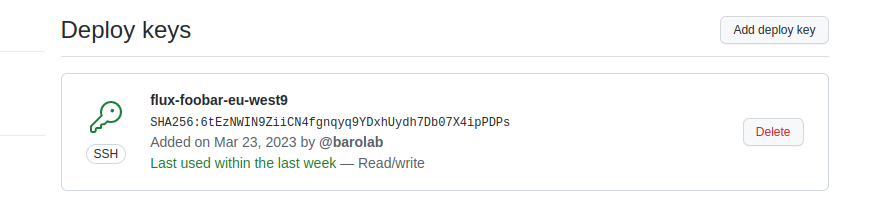

# Challenge

The purpose of this repository is to answer to a challenge that was given me: Deploy a full Kubernetes platform in two different regions to host the [foobar-api](https://github.com/containous/foobar-api).

1. [Introduction](#introduction)
2. [Step 1 - Kubernetes Clusters](#step-1---kubernetes-clusters)
3. [Step 2 - Install Flux](#step-2---install-flux)

## Introduction

The first step is to make some choices regarding the infrastructure. Given the challenge description I see two requirements:

1. The Foobar API must run in Kubernetes
2. It must run in two different regions (with cross-region load balancing in mind)

The first decision made was to go with `GKE`, for a couple of reasons:

1. I don't know anything about `GKE`, but I'm very curious because most comparison I saw put it in first place
2. It seems most of the default addons are builtin, I don't have to bother with `kube-proxy` or the `CNI` for this challenge
3. It's an opportunity to learn more about `GCP`

I didn't want to spend too much time on deploying those resources (`GCP` or `Kubernetes`), so I decided to use tools that I'm familiar with:

1. `terraform` to manage the `GCP` resources
2. `flux` to manage the `Kubernetes` resources

Along the challenge implementation, I will try to note every decision where I believe it could be done better.
Given the time frame, my schedule and my limited bank account, I will probably have to cut corners (especially in terms of security)

## Step 1 - Kubernetes Clusters

The first step is to initialize the Kubernetes clusters with `GCP` and `terraform`.

Let's begin by registering a [GCP account](https://console.cloud.google.com/home/dashboard), and create a project (mine is called `foobar`). Then follow the [setup documentation](./setud.md) to install the and configure the CLI tools.

Before we start creating GKE clusters, we'll first create a GCS bucket to store our Terraform state:

```sh
terraform -chdir=./terraform/root/storage init
terraform -chdir=./terraform/root/storage apply
```

The bucket has versioning enabled in case you want to revert to a previous state.
And the Terraform GCS backend supports locking by default !
That should prevent concurrent execution of Terraform modules

Once this is done we can start the modules in charge of the GKE clusters:

1. [eu-west9](../terraform/production/eu-west9/main.tf)
2. [us-east1](../terraform/production/us-east1/main.tf)

> The code used here is heavily inspired by the example of the [Terraform GKE module](https://github.com/terraform-google-modules/terraform-google-kubernetes-engine/tree/master/examples)

Here's a quick overview of the Terraform code used to spin up the GKE clusters:

```terraform
# Uses the google network module to create a VPC for the GKE cluster
# - It has one primary subnet for the nodes and the control planes (10.0.0.0/16)
# - A secondary subnet for PODs (192.168.0.0/18)
# - A secondary subnet for Services (192.168.64.0/18)

module "network" {
  source  = "terraform-google-modules/network/google"
  version = ">= 4.0.1"

  network_name = "${local.cluster.name}-network"
  subnets = [
    {
      subnet_name   = "${local.cluster.name}-subnet"
      subnet_ip     = "10.0.0.0/20"
      subnet_region = local.region
    },
  ]

  secondary_ranges = {
    "${local.cluster.name}-subnet" = [
      {
        range_name    = "${local.cluster.name}-pods"
        ip_cidr_range = "192.168.0.0/18"
      },
      {
        range_name    = "${local.cluster.name}-services"
        ip_cidr_range = "192.168.64.0/18"
      },
    ]
  }
}

# Now we create the GKE cluster, giving it the network subnets created above
# It'll will deploy the latest version (1.24) with e2-small (cheap, general purpose instances) nodes
module "gke" {
  source      = "terraform-google-modules/kubernetes-engine/google"
  name        = local.cluster.name
  zones       = local.zones
  region      = local.region
  regional    = true
  description = "Foobar GKE in ${local.region}"

  # Networking
  network           = module.network.network_name
  subnetwork        = module.network.subnets_names[0]
  ip_range_pods     = module.network.subnets_secondary_ranges[0].*.range_name[0]
  ip_range_services = module.network.subnets_secondary_ranges[0].*.range_name[1]

  # Version
  release_channel    = "STABLE"
  kubernetes_version = "1.24"

  # Security
  remove_default_node_pool = true
  service_account          = "create"

  # Node pools
  node_pools = [
    {
      name         = "default-small"
      machine_type = "e2-small"
      min_count    = 1
      max_count    = 2
      auto_upgrade = true
      auto_repair  = true
      disk_size_gb = 20
      disk_type    = "pd-standard"
    }
  ]
}
```

We can test on Europe with the following commands:

```sh
# Run terraform to create the VPC + GKE cluster (~5-10 minutes)
$ terraform -chdir=terraform/production/eu-west9/ init
$ terraform -chdir=terraform/production/eu-west9/ apply

# Get access to the GKE cluster
$ export KUBECONFIG=~/.kube/foobar
$ gcloud container clusters get-credentials foobar-europe-west9 --region=europe-west9

# Check it's working fine
$ kubectl get nodes
$ kubectl get pods -A

# Once it's validated, you can delete the GKE cluster to avoid being billed too much
$ terraform -chdir=terraform/production/eu-west9/ destroy -target=module.gke
```

Done ! We now have two GKE clusters in two different regions, next step will be to deploy things on those clusters using Flux

**Improvements**

- [ ] Manage the GCP project ID a bit differently (en environment variable on a laptop is error prone)
- [ ] GitOps the Terraform modules, either with TF Cloud or Flux [terraform-controller](https://github.com/weaveworks/tf-controller)
- [ ] Use a [GCP Service Account](https://developer.hashicorp.com/terraform/language/settings/backends/gcs#running-terraform-on-google-cloud) for Terraform
- [ ] Check some [GCP Best Practices](https://www.whizlabs.com/blog/gcp-best-practices/)

## Step 2 - Install Flux

So now we're on our way to install Flux on our GKE clusters.
Since I'm probably going to destroy/re-create those GKE clusters quite often, I would prefer if Flux comes pre-installed and configured as soon as Terraform is finished.

To do that we're going to create a Terraform module, that we'll instantiate in the same module where the GKE cluster is created.
Ideally the defaults are sane, and I just have to give the module some inputs regarding which Git repository and which path I want to reconcile, something like the following:

```terraform
module "flux" {
  source = "../../modules/flux"

  repositories = {
    foobar-infra = {
      git = {
        url = "ssh://git@github.com/barolab/foobar-infra"
      }

      kustomizations = {
        flux-system = { path = "./kubernetes/production/eu-west9/flux-system"}
      }
    }
  }
}
```

We're going to synchronize only one path for now, it will be `./kubernetes/production/<region>/flux-system`.
This directory will contain more Flux `Kustomization` pointing to other directories in this repo.
This will allow me to test some features like health checks and dependencies!

There's a couple of things that needs to happen for Flux to be working properly:
1. The namespace needs to be created, since the GKE cluster will be empty
2. Flux will need and SSH Key Pair configured as a Deploy Key on the Github Repository
3. This SSH Key Pair needs to be available in a Kubernetes Secret
4. Flux controllers will have to be deployed (only `source`, `kustomize` and `helm` for now)
5. Flux needs the `GitRepository` and `Kustomization` resources to start reconciling resources

All those steps are implemented with Terraform in the [flux module](../terraform/modules/flux/main.tf) !
And the only thing you need to give to Terraform is an environment variable `GITHUB_TOKEN`.
For now I'm using a Github PAT with Read/Write permissions on this repository settings, allowing
the module to add Deploy Keys.

And some evidences that everything work as expected (it uses a temporary branch):



```sh
$ kubectl -n flux-system get ks
NAME                       AGE   READY   STATUS
foobar-infra-flux-system   10m   True    Applied revision: feat-flux-installation@sha1:fe15097a8968ae44b5c7c16bf5eb69c56c4ba10f
podinfo                    66s   True    Applied revision: feat-flux-installation@sha1:fe15097a8968ae44b5c7c16bf5eb69c56c4ba10f

$ kubectl -n podinfo get hr
NAME      AGE     READY   STATUS
podinfo   3m12s   True    Release reconciliation succeeded

$ kubectl -n podinfo get pods
NAME      AGE   READY   STATUS
podinfo   90s   True    Release reconciliation succeeded
```

That's it for the Flux installation step, next we will:
- Add the Foobar API code
- Create a CI job to release the Foobar API Docker Image somewhere
- Deploy it with Flux !

**Improvements**

- [ ] Use a Github Service Account to create the SSH deploy key
- [ ] Find a better way than using an Environment Variable to pass the Github Token to Terraform

## Step 3 - Foobar API deployment

For this step the goal is to have the `foobar-api` up and running on our GKE cluster.
We'll try to access it with a `kubectl port-forward` to make sure it's working properly.

There's a couple of requirements to do so:
1. The `foobar-api` needs to be available as a Docker Image on a Registry
2. The GKE clusters must had access to that Registry
3. The `foobar-api` needs a TLS certificate to boot
4. We need the Kubernetes manifests for the `foobar-api` on Flux

We won't necessarily try to have a valid TLS certificate or push it on a PVC right now.

### The Docker image

For the first requirements, it's rather simple, we add the Go source code under [./app](../app/main.go),
add a [Dockerfile](../app/Dockerfile) and setup a [Github Workflow](../.github/workflows/release.yml) to
automatically release the Docker image on a push to a branch.

### The Registry Secret

The Docker Image will be released on GHCR, and since we're using a private repository we need to have
a Kubernetes Docker config secret with a Token that `kubelet` can use to pull the Docker image.

For simplicity I'll use a PAT from my Github Account instead of using a Service Account, the only permissions
that this token requires is `read:packages`.

We'll pass that to Terraform using the ENV variable, and since we're adding more and more variables to those
Terraform modules, we'll wrap them all into a `.env` file at the root of this repository.

### The TLS certificate

**Improvements**

- [ ] A better release process for the Docker Image, based on Github releases rather than push to any branch
- [ ] Something to automate the Kubernetes Docker config deployment (SealedSecrets / External Secrets, Kyverno, etc...)
